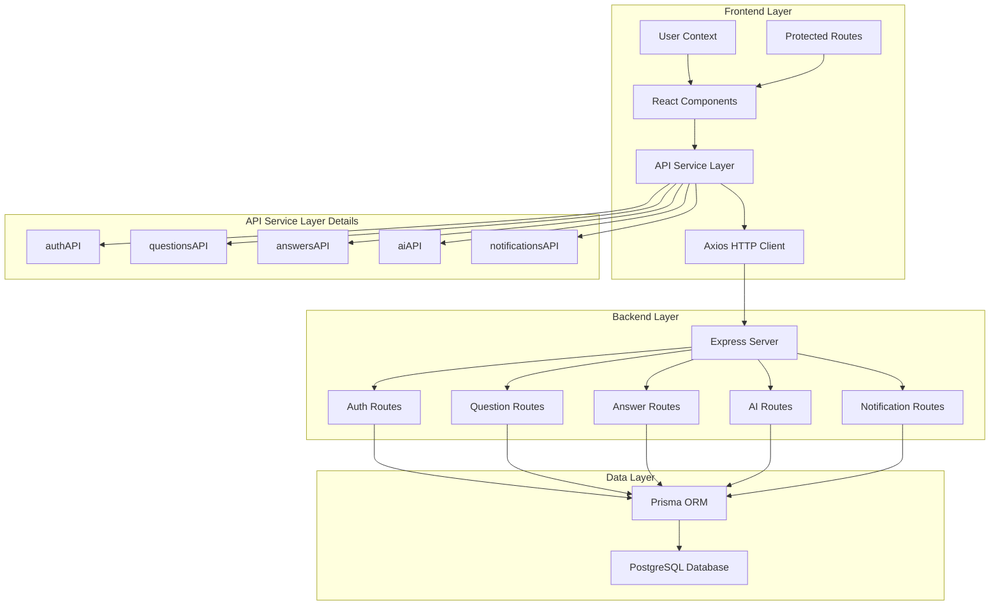

# Design Document

## Overview

This design document outlines the technical approach to fix the frontend-backend integration issues in the StackIt Q&A platform. The solution focuses on creating a seamless connection between the existing React frontend and Node.js/Express backend while maintaining the current UI/UX design and adding missing functionality.

The design follows a phased approach, prioritizing core functionality first, then enhanced features, and finally advanced capabilities. This ensures users get a working application quickly while allowing for iterative improvements.

## Architecture

### Current Architecture
- **Frontend**: React 19 + Vite + Chakra UI + React Router
- **Backend**: Node.js + Express + PostgreSQL + Prisma ORM
- **Authentication**: JWT tokens with localStorage storage
- **API Communication**: Axios with interceptors for token management

### Integration Architecture



## Components and Interfaces

### 1. API Service Layer Redesign

#### Current Issues
- Endpoint mismatches between frontend expectations and backend reality
- Inconsistent data format handling
- Mock data usage instead of real API calls

#### Solution Design

**Updated API Service Structure:**
```javascript
// frontend/src/services/api.js
const api = axios.create({
  baseURL: API_BASE_URL,
  headers: { 'Content-Type': 'application/json' }
});

// Fixed endpoint mappings
export const questionsAPI = {
  getAll: (params) => api.get('/questions', { params }),
  getById: (id) => api.get(`/questions/${id}`),
  create: (questionData) => api.post('/questions', {
    title: questionData.title,
    description: questionData.content, // Map content -> description
    tags: questionData.tags
  }),
  update: (id, questionData) => api.put(`/questions/${id}`, questionData),
  delete: (id) => api.delete(`/questions/${id}`),
  vote: (id, voteType) => api.post(`/questions/${id}/vote`, { 
    voteType: voteType.toUpperCase() // Ensure uppercase format
  })
};

export const answersAPI = {
  create: (answerData) => api.post('/answers', answerData), // Fixed endpoint
  getByQuestionId: (questionId) => api.get(`/answers/question/${questionId}`), // Fixed endpoint
  update: (id, answerData) => api.put(`/answers/${id}`, answerData),
  delete: (id) => api.delete(`/answers/${id}`),
  vote: (id, voteType) => api.post(`/answers/${id}/vote`, { 
    voteType: voteType.toUpperCase() 
  })
};
```

### 2. Data Transformation Layer

#### Problem
Frontend and backend use different field names and data structures.

#### Solution
Create data transformation utilities:

```javascript
// frontend/src/utils/dataTransformers.js
export const transformQuestionForAPI = (frontendQuestion) => ({
  title: frontendQuestion.title,
  description: frontendQuestion.content, // content -> description
  tags: frontendQuestion.tags
});

export const transformQuestionFromAPI = (backendQuestion) => ({
  ...backendQuestion,
  content: backendQuestion.description, // description -> content
  tags: backendQuestion.tags?.map(tag => tag.tag?.name || tag) || []
});

export const transformVoteType = (frontendVoteType) => 
  frontendVoteType.toUpperCase(); // 'up' -> 'UP'
```

### 3. State Management Enhancement

#### Current State
- User authentication state managed via React Context
- Component-level state for UI data
- No global state for questions/answers

#### Enhanced Design
```javascript
// frontend/src/context/AppContext.jsx
export const AppProvider = ({ children }) => {
  const [questions, setQuestions] = useState([]);
  const [loading, setLoading] = useState(false);
  const [error, setError] = useState(null);
  
  const fetchQuestions = async (params = {}) => {
    setLoading(true);
    try {
      const response = await questionsAPI.getAll(params);
      setQuestions(response.data.data.questions);
    } catch (error) {
      setError(error.message);
    } finally {
      setLoading(false);
    }
  };
  
  return (
    <AppContext.Provider value={{
      questions, fetchQuestions, loading, error
    }}>
      {children}
    </AppContext.Provider>
  );
};
```

### 4. Component Integration Strategy

#### HomePage Integration
```javascript
// Replace mock data with real API calls
const HomePage = () => {
  const [questions, setQuestions] = useState([]);
  const [loading, setLoading] = useState(true);
  const [activeTab, setActiveTab] = useState('latest');
  
  useEffect(() => {
    const fetchQuestions = async () => {
      try {
        const params = getParamsForTab(activeTab);
        const response = await questionsAPI.getAll(params);
        setQuestions(response.data.data.questions);
      } catch (error) {
        toast({ title: 'Error loading questions', status: 'error' });
      } finally {
        setLoading(false);
      }
    };
    
    fetchQuestions();
  }, [activeTab]);
  
  const getParamsForTab = (tab) => {
    switch(tab) {
      case 'popular': return { sortBy: 'votes', order: 'desc' };
      case 'unanswered': return { hasAnswers: false };
      default: return { sortBy: 'createdAt', order: 'desc' };
    }
  };
};
```

#### QuestionDetailPage Integration
```javascript
const QuestionDetailPage = () => {
  const { id } = useParams();
  const [question, setQuestion] = useState(null);
  const [answers, setAnswers] = useState([]);
  
  useEffect(() => {
    const fetchData = async () => {
      try {
        const [questionRes, answersRes] = await Promise.all([
          questionsAPI.getById(id),
          answersAPI.getByQuestionId(id)
        ]);
        
        setQuestion(transformQuestionFromAPI(questionRes.data.data));
        setAnswers(answersRes.data.data);
      } catch (error) {
        toast({ title: 'Error loading question', status: 'error' });
      }
    };
    
    fetchData();
  }, [id]);
};
```

## Data Models

### Frontend Data Models
```typescript
interface Question {
  id: string;
  title: string;
  content: string; // Maps to backend 'description'
  tags: string[];
  author: {
    id: string;
    name: string;
    avatar?: string;
  };
  votes: number;
  answers: number;
  createdAt: string;
  isOwner: boolean;
}

interface Answer {
  id: string;
  content: string;
  author: {
    id: string;
    name: string;
    avatar?: string;
  };
  votes: number;
  isAccepted: boolean;
  createdAt: string;
  isOwner: boolean;
  isAI?: boolean;
}

interface VoteRequest {
  voteType: 'UP' | 'DOWN';
}
```

### Backend Data Models (Existing)
```javascript
// Prisma models (already defined)
model Question {
  id          String
  title       String
  description String // Maps to frontend 'content'
  userId      String
  user        User
  answers     Answer[]
  votes       QuestionVote[]
  tags        QuestionTag[]
}

model Answer {
  id         String
  content    String
  isAccepted Boolean
  userId     String
  user       User
  questionId String
  question   Question
  votes      AnswerVote[]
}
```

## Error Handling

### Centralized Error Handling Strategy
```javascript
// frontend/src/utils/errorHandler.js
export const handleAPIError = (error, toast) => {
  if (error.response?.status === 401) {
    // Handle authentication errors
    localStorage.removeItem('token');
    window.location.href = '/login';
    return;
  }
  
  const message = error.response?.data?.message || 'An unexpected error occurred';
  toast({
    title: 'Error',
    description: message,
    status: 'error',
    duration: 5000,
    isClosable: true
  });
};

// Usage in components
try {
  await questionsAPI.create(questionData);
} catch (error) {
  handleAPIError(error, toast);
}
```

### Loading State Management
```javascript
// Custom hook for API operations
export const useAPIOperation = () => {
  const [loading, setLoading] = useState(false);
  const [error, setError] = useState(null);
  const toast = useToast();
  
  const execute = async (operation) => {
    setLoading(true);
    setError(null);
    
    try {
      const result = await operation();
      return result;
    } catch (error) {
      setError(error);
      handleAPIError(error, toast);
      throw error;
    } finally {
      setLoading(false);
    }
  };
  
  return { execute, loading, error };
};
```

## Testing Strategy

### Integration Testing Approach
1. **API Integration Tests**: Verify frontend API calls match backend endpoints
2. **Component Integration Tests**: Test components with real API calls using MSW (Mock Service Worker)
3. **End-to-End Tests**: Test complete user workflows
4. **Error Handling Tests**: Verify proper error handling for various failure scenarios

### Test Structure
```javascript
// Example integration test
describe('Questions Integration', () => {
  test('should fetch and display real questions', async () => {
    // Mock API response
    server.use(
      rest.get('/api/questions', (req, res, ctx) => {
        return res(ctx.json({ data: { questions: mockQuestions } }));
      })
    );
    
    render(<HomePage />);
    
    await waitFor(() => {
      expect(screen.getByText('Real Question Title')).toBeInTheDocument();
    });
  });
});
```

## Performance Considerations

### Optimization Strategies
1. **Lazy Loading**: Load questions and answers on demand
2. **Caching**: Implement client-side caching for frequently accessed data
3. **Pagination**: Implement proper pagination for large datasets
4. **Debounced Search**: Prevent excessive API calls during search
5. **Optimistic Updates**: Update UI immediately for better user experience

### Implementation
```javascript
// Debounced search hook
export const useDebounce = (value, delay) => {
  const [debouncedValue, setDebouncedValue] = useState(value);
  
  useEffect(() => {
    const handler = setTimeout(() => {
      setDebouncedValue(value);
    }, delay);
    
    return () => clearTimeout(handler);
  }, [value, delay]);
  
  return debouncedValue;
};

// Usage in search component
const SearchComponent = () => {
  const [searchTerm, setSearchTerm] = useState('');
  const debouncedSearchTerm = useDebounce(searchTerm, 300);
  
  useEffect(() => {
    if (debouncedSearchTerm) {
      searchQuestions(debouncedSearchTerm);
    }
  }, [debouncedSearchTerm]);
};
```

## Security Considerations

### Authentication & Authorization
- JWT tokens properly managed in HTTP-only cookies or secure localStorage
- Automatic token refresh handling
- Proper route protection for authenticated actions
- Owner-only operations (edit/delete) properly enforced

### Data Validation
- Client-side validation for user experience
- Server-side validation as the source of truth
- Proper sanitization of user input
- XSS protection for rich text content

## Deployment Strategy

### Development Environment
1. Ensure backend runs on port 5000
2. Frontend development server on port 3000
3. Proper CORS configuration
4. Environment variables properly configured

### Production Considerations
1. API base URL configuration
2. Error logging and monitoring
3. Performance monitoring
4. Proper build optimization

This design provides a comprehensive approach to fixing the integration issues while maintaining code quality and user experience. The phased implementation allows for incremental delivery and testing.